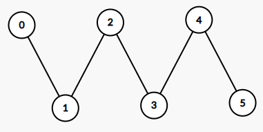
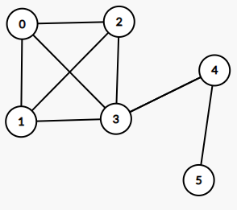
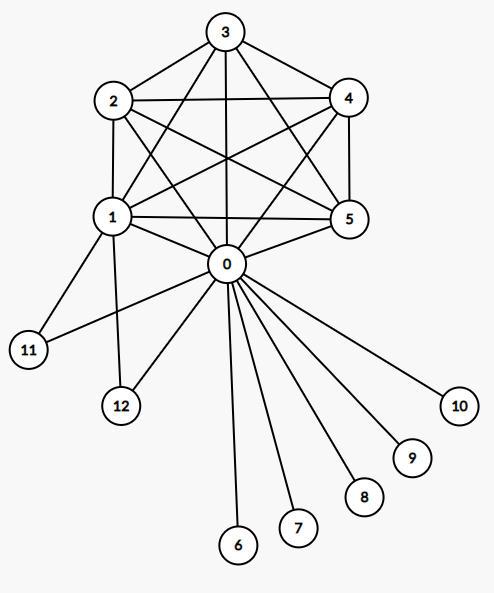
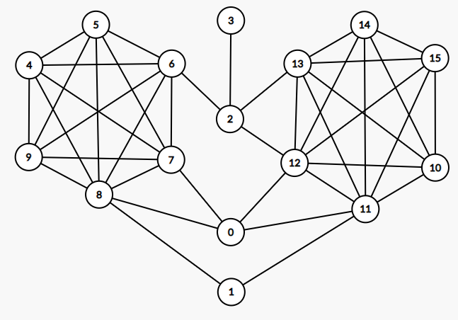

# Examples
---
In this folder, we show several examples to demonstrate the effect of running kmp-parsing code on small toy networks. In all the examples, all nodes are placed in a single cluster in the input clustering.
The command used to reproduce the results is provided below.
```bash
python <kmp-parsing code>.py -e <input edgelist> -c <input clustering file> -o <output clustering file> -k 5 -p 2 -m True
```

## [no\_core](no_core)
This folder contains 2 example clusterings and networks that contain zero kmp-valid clusters at k=5 and p=2.
### [no\_core/1.clustering](no_core/1.clustering) and [no\_core/network\_1.tsv](no_core/network_1.tsv)
As shown in the diagram, network 1 is simply a line with no core substructures. Therefore, running kmp-parsing code on this input will result in zero clusters returned.



*This is a graphical representation of [no\_core/network\_1.tsv](no_core/network_1.tsv), which is an edgelist that represents the network*

The log file of running kmp-parsing code for this clustering and network is saved at [no\_core/parsing\_1.out](no_core/parsing_1.out)

### [no\_core/2.clustering](no_core/2.clustering) and [no\_core/network\_2.tsv](no_core/network_2.tsv)
As shown in the diagram, network 2 consists of a single 4-clique (nodes 0, 1, 2, and 3) with two nodes connected to the clique in a chain. This network does not contain any core substructures at k=5 since kmp-validity at k=5 requires that every node in the core set of nodes be connected to at least five other core nodes. Therefore, running kmp-parsing code on this input will also result in zero clusters returned.



*This is a graphical representation of [no\_core/network\_2.tsv](no_core/network_2.tsv), which is an edgelist that represents the network*

The log file of running kmp-parsing code for this clustering and network is saved at [no\_core/parsing\_2.out](no_core/parsing_2.out)

## [one\_core](one_core)
### [no\_core/3.clustering](no_core/3.clustering) and [no\_core/network\_3.tsv](no_core/network_3.tsv)
As shown in the diagram, network 3 consists of a single 6-clique (nodes 0, 1, 2, 3, 4, and 5), two nodes connected to the clique with two connections (nodes 11 and 12), and five nodes with a single connection each to the clique (nodes 6, 7, 8, 9, and 10). This network does contain a core substructure at k=5. The 6-clique defines the core set of nodes where every node in the core set is connected to at least five other core nodes. Additionally, nodes 11 and 12 are parsed as non-core nodes at p=2 since they have at least two degrees of connection to the set of core nodes. Nodes 6 through 10 are discarded since they do not meet the non-core node criteria at p=2. Therefore, running kmp-parsing code on this input will result in a single cluster that consists of the 6-clique and nodes 11 and 12.



*This is a graphical representation of [one\_core/network\_3.tsv](one_core/network_3.tsv), which is an edgelist that represents the network*

The log file of running kmp-parsing code for this clustering and network is saved at [one\_core/parsing\_3.out](one_core/parsing_3.out). The actual clustering output containing the core nodes and its non-core nodes is saved at [one\_core/3\_parsed.clustering](one_core/3_parsed.clustering).

## [two\_cores](two_cores)
### [no\_core/4.clustering](no_core/4.clustering) and [no\_core/network\_4.tsv](no_core/network_4.tsv)
As shown in the diagram, network 4 consists of two 6-cliques with four additional nodes. Node 0 is connected to both the cliques with a degree of two to each. Node 1 is connected to both the cliques with a degree of one to each. Node 2 has a single connection to one of the cliques and two connections to the other clique. Node 3 has a single connection to node 2, which is not a part of any cliques. This input contains two core substructures. Each of the cliques define a core substructure at k=5. Node 0 meets the non-core criteria at p=2, and it could be a non-core node of either of the cliques. Node 2 meets the non-core criteria at p=2 but it can only be a non-core member to the clique to which it has two connections. Nodes 1 and 3 do not meet the non-core criteria at p=2 since they do not have at least two connections a set of core nodes. Therefore, running kmp-parsing code on this input will result in two clusters that are defined by each of the cliques and their non-core nodes.



*This is a graphical representation of [two\_cores/network\_4.tsv](two_cores/network_4.tsv), which is an edgelist that represents the network*

The log file of running kmp-parsing code for this clustering and network is saved at [two\_cores/parsing\_4.out](two_cores/parsing_4.out). The actual clustering output containing the core nodes and its non-core nodes is saved at [two\_cores/4\_parsed.clustering](two_cores/4_parsed.clustering).
